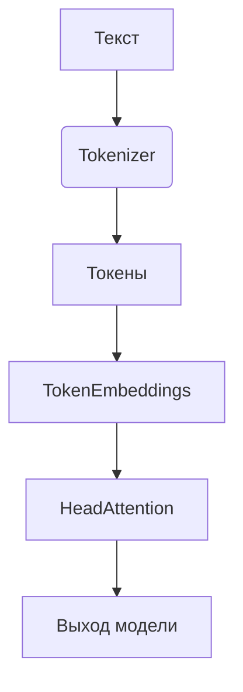

# Simple LLM Framework

[]()
[]()

Унифицированный фреймворк для NLP, включающий:
- 🎯 Токенизацию на основе BPE
- 📊 Векторные представления
- 🧠 Механизмы внимания

## Оглавление
- [Быстрый старт](#быстрый-старт)
- [Архитектура](#архитектура)
- [Модули](#модули)
- [Примеры](#примеры)
- [Установка](#установка)
- [Разработка](#разработка)

## Быстрый старт
```python
from simple_llm import SimpleBPE, TokenEmbeddings, HeadAttention

# 1. Токенизация
bpe = SimpleBPE().fit(text)
tokens = bpe.encode("Привет мир")

# 2. Эмбеддинги
emb_layer = TokenEmbeddings(10000, 256)
embeddings = emb_layer(tokens)

# 3. Внимание
attention = HeadAttention(256, 64)
output = attention(embeddings)
```

## Архитектура


## Модули
### Токенизация
- `SimpleBPE` - базовая реализация BPE
- `OptimizeBPE` - оптимизированная версия

### Эмбеддинги
- `TokenEmbeddings` - обучаемые векторные представления
- `PositionalEmbeddings` - позиционное кодирование

### Transformer
- `HeadAttention` - механизм внимания одной головы

## Примеры
| Файл | Описание |
|-------|----------|
| [example_bpe.py](/example/example_bpe.py) | Базовая токенизация |
| [head_attention_example.py](/example/head_attention_example.py) | Визуализация внимания |

## Установка
```bash
git clone https://github.com/pese-git/simple-llm.git
cd simple-llm
pip install -e .
```

## Разработка
```bash
# Запуск тестов
pytest tests/ -v

# Форматирование кода
black .
```
