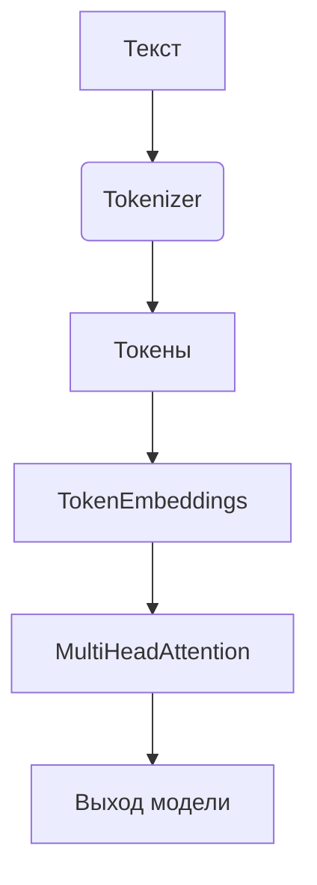

# Simple LLM Framework

[]()
[]()

Унифицированный фреймворк для NLP, включающий:
- 🎯 Токенизацию на основе BPE
- 📊 Векторные представления
- 🧠 Механизмы внимания (Single/Multi-Head)

## Оглавление
- [Быстрый старт](#быстрый-старт)
- [Архитектура](#архитектура)
- [Модули](#модули)
- [Примеры](#примеры)
- [Документация](#документация)
- [Установка](#установка)

## Быстрый старт
```python
from simple_llm import SimpleBPE, MultiHeadAttention

# 1. Токенизация
bpe = SimpleBPE().fit(text_corpus)
tokens = bpe.encode("Пример текста")

# 2. Многоголовое внимание
mha = MultiHeadAttention(
    num_heads=8,
    emb_size=256,
    head_size=32
)
output = mha(torch.randn(1, 10, 256))  # [batch, seq_len, emb_size]
```

## Архитектура


## Модули
### Токенизация
- `SimpleBPE` - базовая реализация BPE
- `OptimizeBPE` - оптимизированная версия

### Эмбеддинги
- `TokenEmbeddings` - обучаемые векторные представления
- `PositionalEmbeddings` - позиционное кодирование

### Transformer
- `HeadAttention` - одно-головое внимание
- `MultiHeadAttention` - многоголовое внимание (4-16 голов)

## Примеры
```bash
# Запуск примеров
python -m example.multi_head_attention_example
```

## Документация
- [Токенизация](/doc/bpe_algorithm.md)
- [Эмбеддинги](/doc/token_embeddings_ru.md)
- [MultiHeadAttention](/doc/multi_head_attention_ru.md)

## Установка
```bash
git clone https://github.com/pese-git/simple-llm.git
cd simple-llm
pip install -e .
```

## Разработка
```bash
# Запуск тестов
pytest tests/ -v

# Проверка стиля кода
flake8 .

# Форматирование
black .
```
