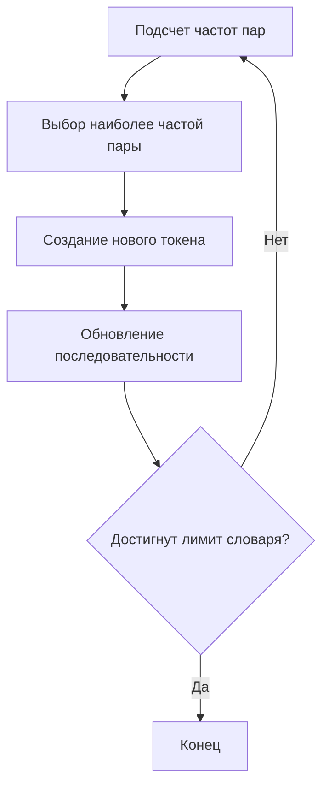

# Byte Pair Encoding (BPE) Algorithm

## Введение

Byte Pair Encoding (BPE) - это алгоритм компрессии данных, адаптированный для токенизации текста в обработке естественного языка. В контексте языковых моделей BPE используется для создания эффективного словаря подстрок (токенов).

## Основные понятия

- **Токен** - элементарная единица текста (символ или последовательность символов)
- **Словарь** - набор уникальных токенов, используемых для представления текста
- **Частота пары** - количество раз, когда два токена встречаются вместе в тексте

## Алгоритм работы

### 1. Инициализация
```python
Исходный текст → Разбить на символы → Первоначальный словарь
```
Пример:
```
"мама" → ['м', 'а', 'м', 'а']
```

### 2. Основной цикл


### 3. Детализация шагов

#### Шаг 1: Подсчет частот пар
Для текущей последовательности токенов подсчитываем все пары соседних токенов:
```
Текст: "мама мыла"
Токены: ['м', 'а', 'м', 'а', ' ', 'м', 'ы', 'л', 'а']
Пары: ('м','а'), ('а','м'), ('м','а'), ('а',' '), (' ','м'), ('м','ы'), ('ы','л'), ('л','а')
```

#### Шаг 2: Выбор пары для слияния
Находим пару с максимальной частотой. При равенстве частот выбираем пару, которая встречается раньше в тексте.

#### Шаг 3: Слияние
Объединяем выбранную пару в новый токен и заменяем все её вхождения в тексте:
```
Выбранная пара: ('м', 'а')
Новый токен: 'ма'
Обновленная последовательность: ['ма', 'ма', ' ', 'м', 'ы', 'л', 'а']
```

#### Шаг 4: Обновление словаря
Добавляем новый токен в словарь:
```
Словарь: ['м', 'а', ' ', 'ы', 'л', 'ма']
```

### 4. Критерии остановки

1. Достижение заданного размера словаря
2. Отсутствие пар для слияния (все возможные пары уже добавлены)
3. Достижение максимального числа итераций

## Псевдокод

```python
def train_bpe(text, vocab_size):
    # Инициализация
    tokens = list(text)
    vocab = set(tokens)
    
    while len(vocab) < vocab_size:
        # Подсчет пар
        pairs = get_pairs(tokens)
        if not pairs:
            break
            
        # Выбор наиболее частой пары
        best_pair = max(pairs, key=pairs.get)
        
        # Слияние
        new_tokens = []
        i = 0
        while i < len(tokens):
            if i < len(tokens)-1 and (tokens[i], tokens[i+1]) == best_pair:
                new_tokens.append(best_pair[0] + best_pair[1])
                i += 2
            else:
                new_tokens.append(tokens[i])
                i += 1
        tokens = new_tokens
        
        # Обновление словаря
        vocab.add(best_pair[0] + best_pair[1])
    
    return vocab
```

## Пример работы

**Исходный текст**: "мама мыла раму"

**Итерация 1**:
- Пара ('м','а') встречается 2 раза
- Новый токен: 'ма'
- Текст: ['ма', 'ма', ' ', 'м', 'ы', 'л', 'а', ' ', 'р', 'а', 'м', 'у']

**Итерация 2**:
- Пара ('ма',' ') встречается 1 раз
- Новый токен: 'ма '
- Текст: ['ма ', 'ма', 'мы', 'л', 'а', ' ', 'р', 'а', 'м', 'у']

**Результирующий словарь** (частично):
['м', 'а', ' ', 'ы', 'л', 'р', 'у', 'ма', 'ма ', 'мы']

## Применение в языковых моделях

1. Эффективное представление редких слов
2. Снижение размерности входных данных
3. Возможность обработки OOV (Out-of-Vocabulary) слов

## Ограничения

1. Чувствительность к регистру (можно решить предварительной нормализацией)
2. Зависимость от обучающего корпуса
3. Не всегда выделяет лингвистически осмысленные морфемы

## Дополнительные материалы

1. [Original BPE paper](https://arxiv.org/abs/1508.07909)
2. [BPE in HuggingFace](https://huggingface.co/docs/transformers/tokenizer_summary)
3. [Practical guide to BPE](https://towardsdatascience.com/byte-pair-encoding-subword-based-tokenization-algorithm-77828a70bee0)
