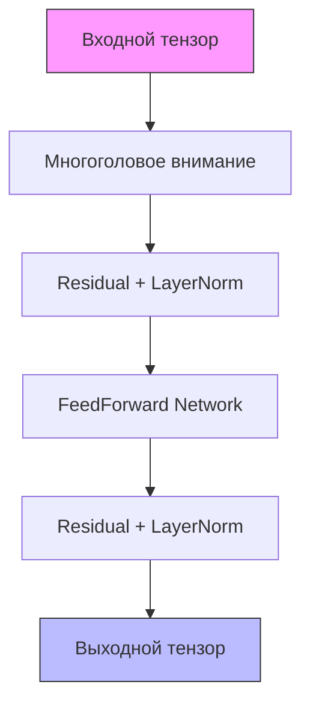

# Декодер Transformer

## Назначение
Декодер - ключевой компонент архитектуры Transformer, предназначенный для:
- Генерации последовательностей (текст, код и др.)
- Обработки входных данных с учетом контекста
- Постепенного построения выходной последовательности
- Работы с масками внимания (предотвращение "утечки" будущего)

## Алгоритм работы



1. **Self-Attention**:
   - Вычисление внимания между всеми позициями
   - Учет масок для автопрегрессивного декодирования
   - Multi-head механизм (параллельные вычисления)

2. **Residual Connection + LayerNorm**:
   - Стабилизация градиентов
   - Ускорение обучения
   - Нормализация активаций

3. **FeedForward Network**:
   - Нелинейное преобразование
   - Расширение скрытого пространства
   - Дополнительная емкость модели

## Использование

```python
from simple_llm.transformer.decoder import Decoder

# Инициализация
decoder = Decoder(
    num_heads=8,
    emb_size=512,
    head_size=64,
    max_seq_len=1024
)

# Прямой проход
x = torch.randn(1, 10, 512)  # [batch, seq_len, emb_size]
output = decoder(x)

# С маской
mask = torch.tril(torch.ones(10, 10))
masked_output = decoder(x, mask)
```

## Параметры

| Параметр     | Тип  | Описание |
|--------------|------|----------|
| num_heads    | int  | Количество голов внимания |
| emb_size     | int  | Размерность эмбеддингов |
| head_size    | int  | Размерность каждой головы |
| max_seq_len  | int  | Макс. длина последовательности |
| dropout      | float| Вероятность дропаута (0.1 по умолч.) |

## Применение в архитектурах

- GPT (автопрегрессивные модели)
- Нейронный машинный перевод
- Генерация текста
- Кодогенерация

## Особенности реализации

1. **Масштабирование**:
   - Поддержка длинных последовательностей
   - Оптимизированные вычисления внимания

2. **Обучение**:
   - Поддержка teacher forcing
   - Автопрегрессивное декодирование

3. **Оптимизации**:
   - Кэширование ключей/значений
   - Пакетная обработка
