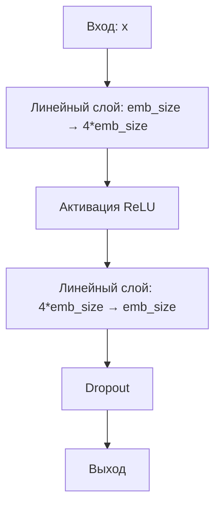

# FeedForward - Прямая полносвязная сеть трансформера

## Назначение
Модуль реализует двухслойную нейронную сеть, которая:
- Добавляет нелинейность в трансформер
- Расширяет и сжимает представление
- Применяет dropout для регуляризации

## Алгоритм работы



1. **Расширение признаков**:
   ```python
   h = W1 * x + b1  # W1: [emb_size, 4*emb_size]
   ```

2. **Нелинейность**:
   ```python
   h = relu(h)
   ```

3. **Сжатие признаков**:
   ```python
   out = W2 * h + b2  # W2: [4*emb_size, emb_size]
   ```

4. **Регуляризация**:
   ```python
   out = dropout(out)
   ```

## Пример использования
```python
from simple_llm.transformer import FeedForward

# Инициализация
ff = FeedForward(emb_size=512, dropout=0.1)

# Прямой проход
x = torch.randn(1, 10, 512)  # [batch, seq_len, emb_size]
output = ff(x)  # [1, 10, 512]
```

## Параметры
| Параметр   | Тип    | Описание                     |
|------------|--------|------------------------------|
| `emb_size` | int    | Размерность входных/выходных векторов |
| `dropout`  | float  | Вероятность dropout (0.0-1.0)|

## Особенности
- Сохраняет размерность входа/выхода
- Автоматически обрабатывает batch и последовательности
- Поддерживает режимы train/eval

[Пример визуализации](/example/feed_forward_example.py)
