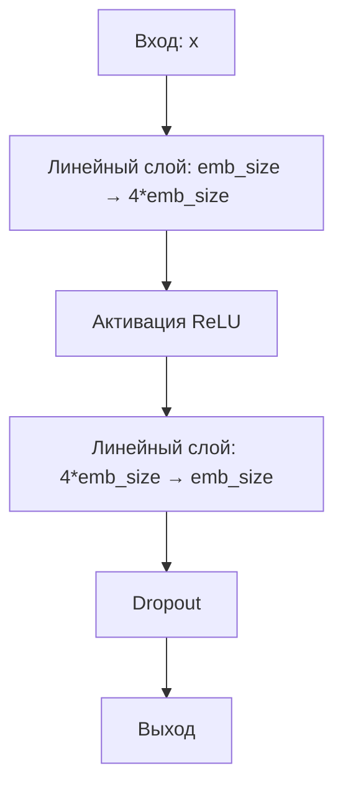

# FeedForward - Прямая полносвязная сеть трансформера

> **Документ актуален для Simple-LLM v1.0 (июль 2025)**

---

**Краткое summary:**
Документ описывает модуль двухслойной прямой полносвязной сети (Feed Forward) в трансформерах. Включает алгоритм, пример использования, параметры и типовые ошибки.

---

**Структура документа:**
- Назначение
- Алгоритм работы
- Пример использования
- Параметры
- Особенности
- Типовые ошибки и их решения

---

## Назначение
Модуль реализует двухслойную нейронную сеть, которая:
- Добавляет нелинейность в трансформер
- Расширяет и сжимает представление
- Применяет dropout для регуляризации

## Алгоритм работы



1. **Расширение признаков**:
   ```python
   h = W1 * x + b1  # W1: [emb_size, 4*emb_size]
   ```

2. **Нелинейность**:
   ```python
   h = relu(h)
   ```

3. **Сжатие признаков**:
   ```python
   out = W2 * h + b2  # W2: [4*emb_size, emb_size]
   ```

4. **Регуляризация**:
   ```python
   out = dropout(out)
   ```

## Пример использования
```python
from simple_llm.transformer import FeedForward

# Инициализация
ff = FeedForward(emb_size=512, dropout=0.1)

# Прямой проход
x = torch.randn(1, 10, 512)  # [batch, seq_len, emb_size]
output = ff(x)  # [1, 10, 512]
```

## Параметры
| Параметр   | Тип    | Описание                     |
|------------|--------|------------------------------|
| `emb_size` | int    | Размерность входных/выходных векторов |
| `dropout`  | float  | Вероятность dropout (0.0-1.0)|

## Рекомендации
- Dropout обычно выбирают 0.1–0.3
- Следите, чтобы emb_size совпадал с размерностью входа/выхода
- Используйте режимы train/eval корректно
- Для визуализации используйте [пример](/example/feed_forward_example.py)

---

## Типовые ошибки и их решения

### Ошибка: Размерности не совпадают при прямом проходе
**Возможные причины:**
- emb_size не совпадает с размерностью входных данных

**Решение:**
- Проверьте, что emb_size слоя FeedForward совпадает с размерностью последнего слоя перед ним

### Ошибка: Модель не обучается (loss не уменьшается)
**Возможные причины:**
- Dropout слишком высокий
- Ошибка в подключении слоя к модели

**Решение:**
- Попробуйте уменьшить dropout
- Проверьте, что слой FeedForward включён в модель и его параметры передаются в оптимизатор

### Ошибка: CUDA out of memory
**Возможные причины:**
- Слишком большой batch_size или размерность emb_size

**Решение:**
- Уменьшите batch_size или emb_size

---
- Поддерживает режимы train/eval

[Пример визуализации](/example/feed_forward_example.py)
