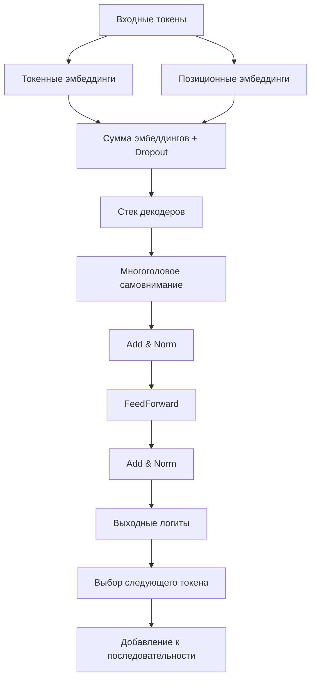

# Документация по GPT модели

> **Документ актуален для Simple-LLM v1.0 (июль 2025)**

---

**Краткое summary:**
Этот документ подробно описывает архитектуру и практическое применение GPT (Generative Pre-trained Transformer) — авторегрессивной языковой модели, реализованной в Simple-LLM. Документ предназначен для разработчиков и исследователей, желающих понять детали реализации и настройки GPT-модели.

---

**Структура документа:**
- Общее описание
- Архитектура и алгоритм
- Практическое использование
- Особенности генерации
- Обучение модели
- Типовые ошибки и их решения

---

## 1. Общее описание
GPT (Generative Pre-trained Transformer) - это авторегрессивная модель генерации текста на основе архитектуры трансформера.

**Ключевые особенности реализации:**
- Поддержка различных режимов генерации (жадный поиск, сэмплирование)
- Многослойный декодер с механизмом самовнимания
- Оптимизированная работа на CPU/GPU
- Гибкая настройка параметров генерации
- Поддержка комбинированных стратегий (top-k + top-p)

## 2. Архитектура и алгоритм

### 2.1 Полная блок-схема


### 2.2 Режимы генерации
1. **Жадный поиск** (do_sample=False):
   - Всегда выбирает токен с максимальной вероятностью
   - Детерминированный результат

2. **Вероятностное сэмплирование** (do_sample=True):
   - С температурой (temperature=0.5-1.5)
   - Top-k (top_k=10-100)
   - Nucleus sampling (top_p=0.7-0.95)
   - Комбинированный режим (top_k + top_p)

## 3. Практическое использование

### 3.1 Инициализация модели
```python
from simple_llm.transformer.gpt import GPT

model = GPT(
    vocab_size=10000,    # Размер словаря
    max_seq_len=512,     # Макс. длина контекста
    emb_size=768,        # Размерность эмбеддингов
    num_heads=12,        # Число голов внимания
    head_size=64,        # Размерность головы
    num_layers=6,        # Количество слоев декодера
    dropout=0.1,         # Вероятность dropout
    device='cuda'        # 'cpu' или 'cuda'
)
```

### 3.2 Генерация текста
```python
output = model.generate(
    input_ids,           # Входные токены [batch_size, seq_len]
    max_new_tokens=50,    # Макс. число новых токенов
    do_sample=True,      # Режим сэмплирования
    temperature=0.9,     # Контроль случайности (0.1-2.0)
    top_k=50,            # Ограничение по топ-k токенам
    top_p=0.9,           # Параметр nucleus sampling
    repetition_penalty=1.2, # Штраф за повторения
    stop_tokens=None     # Токены для остановки генерации
)
```

### 3.3 Примеры использования

**Базовый пример:**
```python
text = "Анализ данных - это"
input_ids = tokenizer.encode(text)
output_ids = model.generate(input_ids, max_new_tokens=100)
generated_text = tokenizer.decode(output_ids[0])
```

**Креативная генерация:**
```python
output = model.generate(
    input_ids,
    max_new_tokens=100,
    do_sample=True,
    temperature=1.3,
    top_k=60,
    top_p=0.85
)
```

## 4. Оптимизация и настройка

### 4.1 Рекомендуемые параметры

| Тип задачи       | Параметры                     |
|------------------|-------------------------------|
| Точные ответы    | temp=0.7, top_k=40, top_p=0.8 |
| Креативная письмо| temp=1.2, top_k=60, top_p=0.9 |
| Кодогенерация    | temp=0.8, top_k=50, top_p=0.85|

### 4.2 Производительность

**Для CPU:**
```python
model = GPT(
    emb_size=256,
    num_layers=4,
    num_heads=8,
    device='cpu'
)
```

**Для GPU:**
```python
model = GPT(
    emb_size=1024,
    num_layers=12,
    device='cuda'
)
```

## 5. Ограничения и решения

| Ограничение               | Решение                      |
|---------------------------|------------------------------|
| Длинные последовательности| Чанкование входных данных    |
| Высокая загрузка памяти   | Уменьшение batch_size        |
| Повторы в генерации       | Настройка repetition_penalty |
| Медленная генерация       | Кэширование ключей/значений  |

## 6. Обучение модели

Метод `fit()` позволяет обучать модель GPT на ваших данных.

### 6.1 Параметры обучения
```python
model.fit(
    train_loader,       # DataLoader с обучающими данными
    valid_loader=None,  # Опциональный DataLoader для валидации
    num_epoch=10,       # Количество эпох
    learning_rate=0.001 # Скорость обучения
)
```

### 6.2 Пример обучения
```python
from torch.utils.data import DataLoader, TensorDataset

# Создание синтетических данных
inputs = torch.randint(0, 10000, (1000, 32))  # 1000 примеров по 32 токена
targets = torch.roll(inputs, -1, dims=1)      # Сдвиг на 1 токен вперед

dataset = TensorDataset(inputs, targets)
train_loader = DataLoader(dataset, batch_size=32)

model = GPT(...)  # Инициализация модели
model.fit(train_loader, num_epoch=5)
```

### 6.3 Особенности обучения
- Автоматическое определение устройства (CPU/GPU)
- Сохранение истории потерь в атрибутах:
  - `model.train_loss` - потери на обучении
  - `model.validation_loss` - потери на валидации (если есть)
- Поддержка ранней остановки (через callback)

## 7. Дополнительные материалы
- [Примеры использования](../example/example_gpt.py)
- [Пример обучения](../example/train_gpt_example.py)
- [Тесты](../tests/test_gpt.py)
- [Оптимизация производительности](performance_guide.md)
