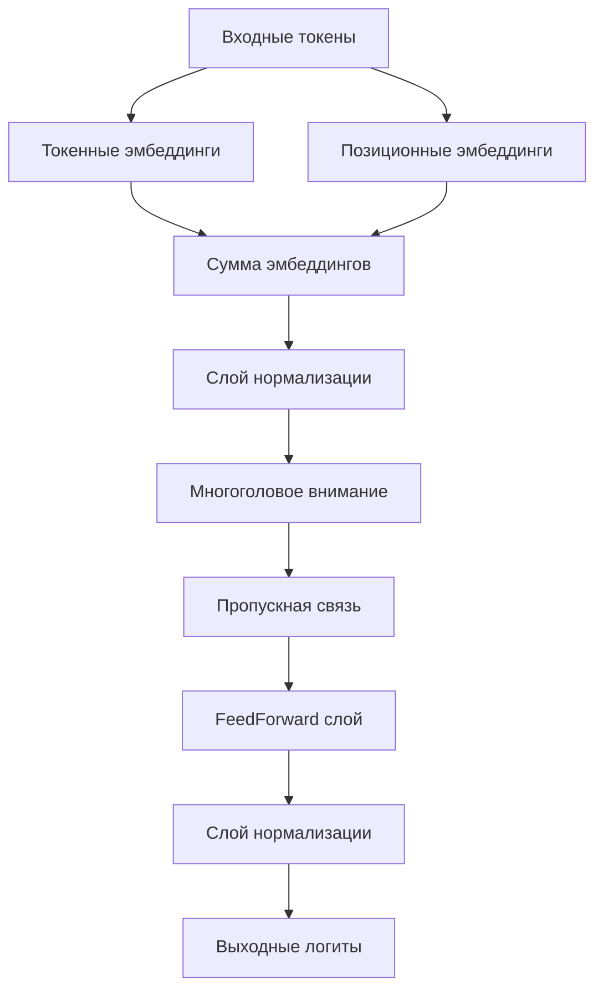

# Документация по GPT модели (рус)

## 1. Общее описание
GPT (Generative Pre-trained Transformer) - это архитектура трансформера для генерации текста, основанная на механизме внимания.

**Основные характеристики:**
- Авторегрессивная генерация
- Многослойный декодер
- Самовнимание с маской

## 2. Алгоритм работы

### 2.1 Архитектура


### 2.2 Процесс генерации
1. Токенизация входного текста
2. Вычисление эмбеддингов:
   - Токенные + позиционные
3. Прохождение через N декодеров:
   - Самовнимание с маской
   - Полносвязные слои
4. Преобразование в вероятности
5. Выбор следующего токена

## 3. Использование

### 3.1 Инициализация
```python
from simple_llm.transformer.gpt import GPT

model = GPT(
    vocab_size=10000,
    max_seq_len=512,
    emb_size=768,
    num_heads=12,
    head_size=64,
    num_layers=6
)
```

### 3.2 Генерация текста
```python
output = model.generate(input_ids, max_new_tokens=50)
```

## 4. Гиперпараметры

| Параметр       | Описание                          |
|----------------|-----------------------------------|
| vocab_size     | Размер словаря                   |
| max_seq_len    | Макс. длина последовательности   |
| emb_size       | Размерность эмбеддингов          |
| num_heads      | Количество голов внимания        |
| head_size      | Размерность головы внимания      |
| num_layers     | Количество слоев декодера        |

## 5. Примеры применения
- Генерация текста
- Дозаполнение форм
- Кодогенерация
- Чат-боты

## 6. Ограничения
- Требует больших вычислительных ресурсов
- Ограничена максимальной длиной последовательности
- Может генерировать некорректный текст
