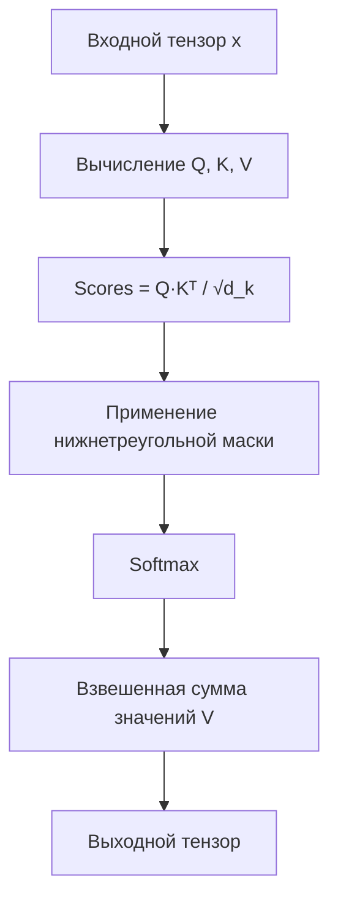

# HeadAttention - Механизм самовнимания одной головы

> **Документ актуален для Simple-LLM v1.0 (июль 2025)**

---

**Краткое summary:**
Данный файл описывает реализацию механизма внимания одной головы (Single Head Attention) в трансформерах. Охватывает основные этапы вычислений, пример использования и типовые ошибки.

---

**Структура документа:**
- Назначение
- Алгоритм работы
- Пример использования
- Типовые ошибки и их решения

---

## Назначение
Модуль реализует механизм внимания одной головы из архитектуры Transformer. Основные применения:
- Моделирование зависимостей в последовательностях
- Обработка естественного языка (NLP)
- Генерация текста с учетом контекста
- Анализ временных рядов

## Алгоритм работы



1. **Линейные преобразования**:
   ```python
   Q = W_q·x, K = W_k·x, V = W_v·x
   ```

2. **Вычисление attention scores**:
   ```python
   scores = matmul(Q, K.transpose(-2, -1)) / sqrt(head_size)
   ```

3. **Маскирование**:
   ```python
   scores.masked_fill_(mask == 0, -inf)  # Causal masking
   ```

4. **Взвешивание**:
   ```python
   weights = softmax(scores, dim=-1)
   output = matmul(weights, V)
   ```

## Пример использования
```python
import torch
from simple_llm.transformer.head_attention import HeadAttention

# Параметры
emb_size = 512
head_size = 64
max_seq_len = 1024

# Инициализация
attn_head = HeadAttention(emb_size, head_size, max_seq_len)

# Пример входа (batch_size=2, seq_len=10)
x = torch.randn(2, 10, emb_size)
output = attn_head(x)  # [2, 10, head_size]
```

---

## Типовые ошибки и их решения

### Ошибка: Размерности не совпадают при умножении матриц
**Возможные причины:**
- Несовпадение emb_size и head_size при инициализации
- Некорректная форма входного тензора

**Решение:**
- Проверьте, что emb_size делится на head_size без остатка
- Убедитесь, что вход имеет форму [batch_size, seq_len, emb_size]

### Ошибка: CUDA out of memory
**Возможные причины:**
- Слишком большой batch_size или seq_len

**Решение:**
- Уменьшите batch_size или seq_len

### Ошибка: Не работает маскирование
**Возможные причины:**
- Неправильная форма или тип маски

**Решение:**
- Проверьте, что mask совпадает по размерности с attention scores

## Рекомендации по использованию
- Следите, чтобы emb_size делился на head_size без остатка
- Для визуализации весов используйте специализированные инструменты
- Для сложных задач используйте MultiHeadAttention
- Размер головы (`head_size`) обычно выбирают 64-128
- Для длинных последовательностей (>512) используйте оптимизации:
  - Локальное внимание
  - Разреженные паттерны

## Особенности реализации

### Ключевые компоненты
| Компонент       | Назначение                          |
|-----------------|-------------------------------------|
| `self._q`       | Линейный слой для Query             |
| `self._k`       | Линейный слой для Key               |
| `self._v`       | Линейный слой для Value             |
| `self._tril_mask`| Нижнетреугольная маска             |

### Ограничения
- Требует O(n²) памяти для матрицы внимания
- Поддерживает только causal-режим
- Фиксированный максимальный размер последовательности

3. Сочетайте с MultiHeadAttention для лучшего качества

[Дополнительные примеры](/example/attention_examples.py)
