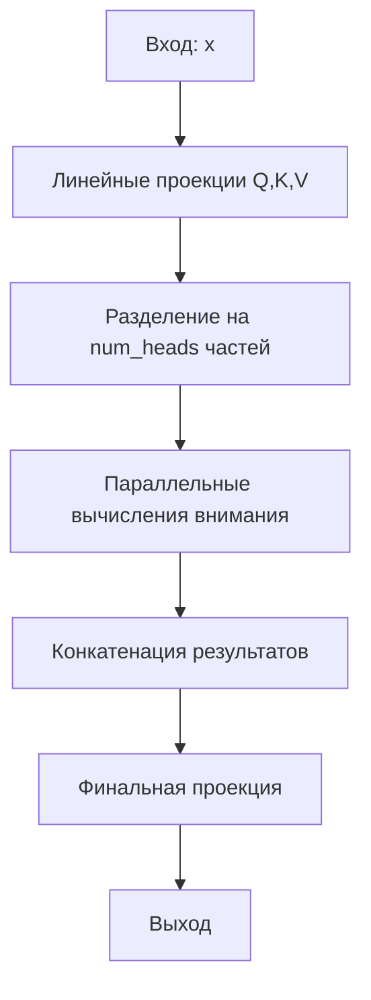

# MultiHeadAttention - Многоголовый механизм внимания

## Назначение
Модуль реализует ключевой компонент архитектуры Transformer, который:
- Параллельно вычисляет несколько типов внимания
- Позволяет модели фокусироваться на разных аспектах данных
- Улучшает качество в задачах:
  - Машинного перевода
  - Генерации текста
  - Классификации последовательностей

## Алгоритм работы



1. **Инициализация проекций**:
   ```python
   self._q = nn.Linear(emb_size, num_heads * head_size)
   self._k = nn.Linear(emb_size, num_heads * head_size)
   self._v = nn.Linear(emb_size, num_heads * head_size)
   ```

2. **Разделение на головы**:
   ```python
   q = q.view(batch_size, seq_len, num_heads, head_size)
   ```

3. **Вычисление внимания**:
   ```python
   scores = (q @ k.transpose(-2, -1)) / math.sqrt(head_size)
   ```

## Пример использования
```python
from simple_llm.transformer import MultiHeadAttention

# Инициализация
mha = MultiHeadAttention(
    num_heads=8,
    emb_size=512,
    head_size=64,
    max_seq_len=1024
)

# Пример входа
x = torch.randn(1, 50, 512)  # [batch_size, seq_len, emb_size]
output = mha(x)  # [1, 50, 512]
```

## Параметры
| Параметр      | Тип  | Описание                     |
|---------------|------|------------------------------|
| `num_heads`   | int  | Количество голов внимания    |
| `emb_size`    | int  | Размерность входных эмбеддингов|
| `head_size`   | int  | Размерность каждой головы    |
| `max_seq_len` | int  | Максимальная длина последовательности|

## Рекомендации
1. Размерность должна делиться на число голов:
   ```python
   assert emb_size % num_heads == 0
   ```
2. Для визуализации весов:
   ```python
   weights = [head.get_attention_weights(x) for head in mha._heads]
   ```

[Пример визуализации](/example/multi_head_attention_example.py)
