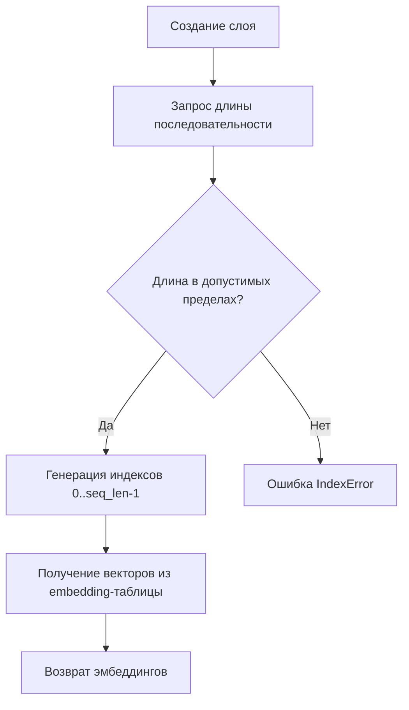

# PositionalEmbeddings - Позиционные эмбеддинги

> **Документ актуален для Simple-LLM v1.0 (июль 2025)**

---

**Краткое summary:**
Документ описывает работу слоя позиционных эмбеддингов в трансформерах. Включает алгоритм, пример использования, сравнение подходов и типовые ошибки.

---

**Структура документа:**
- Назначение
- Алгоритм работы
- Пример использования
- Сравнение подходов
- Оптимальные практики
- Типовые ошибки и их решения

---

## Назначение
Позиционные эмбеддинги добавляют информацию о порядке элементов в последовательности. Критически важны для:
- Transformer-архитектур
- Моделей обработки текста (BERT, GPT)
- Задач с временными рядами

## Алгоритм работы



1. **Инициализация**:
   - Создается таблица размером `max_seq_len x emb_size`
   - Каждая позиция получает уникальный обучаемый вектор

2. **Работа**:
   - Принимает длину последовательности `seq_len`
   - Возвращает тензор формы `[seq_len, emb_size]`

## Пример использования
```python
# Инициализация
pos_emb = PositionalEmbeddings(max_seq_len=512, emb_size=128)

# Получение эмбеддингов для 50 элементов
embeddings = pos_emb(50)  # shape: [50, 128]

# Интеграция в модель
class TransformerBlock(nn.Module):
    def __init__(self):
        self.pos_emb = PositionalEmbeddings(512, 128)
        
    def forward(self, x):
        pos = self.pos_emb(x.size(1))  # Добавляем к токенным эмбеддингам
        return x + pos
```

## Сравнение подходов
| Метод               | Обучаемость | Плюсы                          | Минусы                |
|----------------------|-------------|--------------------------------|-----------------------|
| Обучаемые            | Да          | Гибкость                       | Требует данных        |
| Синусоидальные       | Нет         | Хорошая обобщающая способность | Фиксированный паттерн |

## Рекомендации
- Для `max_seq_len` берите с запасом (+20%)
- Размерность делайте равной размерности токенных эмбеддингов
- Для длинных последовательностей комбинируйте с синусоидальными

---

## Типовые ошибки и их решения

### Ошибка: IndexError при запросе эмбеддингов
**Возможные причины:**
- seq_len превышает max_seq_len, заданный при инициализации слоя

**Решение:**
- Увеличьте max_seq_len при создании слоя
- Проверяйте длину входных данных заранее

### Ошибка: Размерности не совпадают при сложении с токенными эмбеддингами
**Возможные причины:**
- Размерность позиционных и токенных эмбеддингов не совпадает

**Решение:**
- Убедитесь, что emb_size одинаков для обоих слоев

### Ошибка: Модель не обучается (позиционные эмбеддинги не обновляются)
**Возможные причины:**
- Параметры слоя не добавлены в оптимизатор

**Решение:**
- Проверьте, что слой PositionalEmbeddings включён в модель и его параметры передаются в оптимизатор

---
