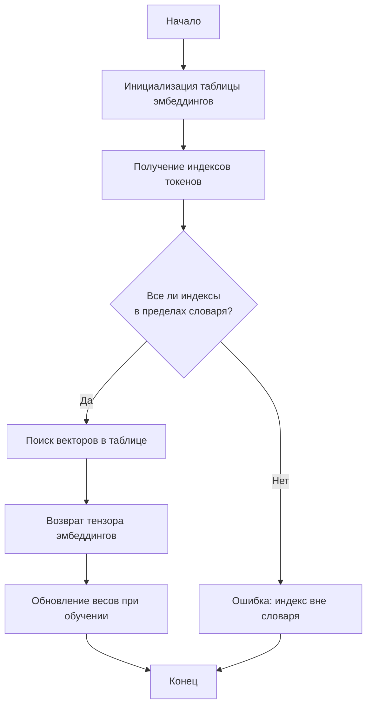

# TokenEmbeddings - Векторные представления токенов

## Назначение
Модуль `TokenEmbeddings` преобразует дискретные индексы токенов в плотные векторные представления (эмбеддинги). Это фундаментальный компонент большинства нейросетевых моделей для обработки естественного языка (NLP).

## Алгоритм работы



1. **Инициализация**:
   - Создается таблица эмбеддингов размером `vocab_size x emb_size`
   - Каждая строка таблицы соответствует векторному представлению одного токена
   - Инициализация происходит случайным образом (обычно из нормального распределения)

2. **Преобразование токенов**:
   - На вход принимается тензор целых чисел (индексов токенов)
   - Для каждого индекса выполняется "lookup" в таблице эмбеддингов
   - Возвращается тензор векторных представлений

3. **Обучение**:
   - Веса эмбеддингов обновляются в процессе обучения модели
   - Сходные по значению токены получают близкие векторные представления

## Использование
```python
from simple_llm.embedding.token_embedings import TokenEmbeddings

# Инициализация
embedding_layer = TokenEmbeddings(
    vocab_size=10000,  # размер словаря
    emb_size=300       # размерность векторов
)

# Пример использования
tokens = torch.tensor([[1, 2, 3], [4, 5, 6]])  # индексы токенов
embeddings = embedding_layer(tokens)  # векторные представления
```

## Параметры
| Параметр   | Тип | Описание |
|------------|-----|----------|
| vocab_size | int | Размер словаря (количество уникальных токенов) |
| emb_size   | int | Размерность векторных представлений |

## Особенности
- **Автоматическое обучение**: Векторы адаптируются в процессе тренировки модели
- **Эффективность**: Быстрое преобразование индексов в векторы
- **Гибкость**: Может использоваться как самостоятельный слой или часть более сложной архитектуры

## Типичные сценарии использования
1. Первый слой в нейросетевых моделях NLP
2. Представление категориальных признаков
3. Создание плотных представлений для sparse данных

## Рекомендации
- Для больших словарей используйте размерность 256-1024
- При использовании предобученных эмбеддингов можно заморозить слой (embedding_layer.requires_grad_(False))
- Для обработки неизвестных токенов (OOV) резервируйте нулевой индекс